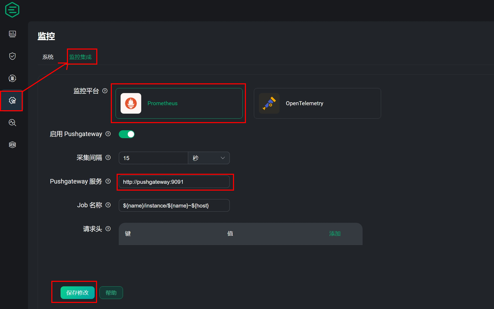
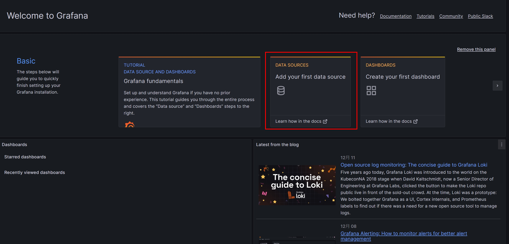
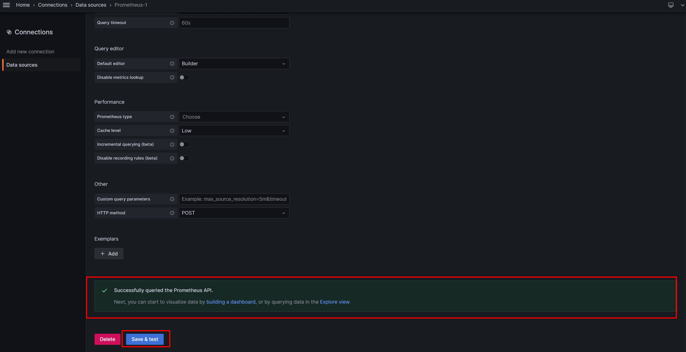
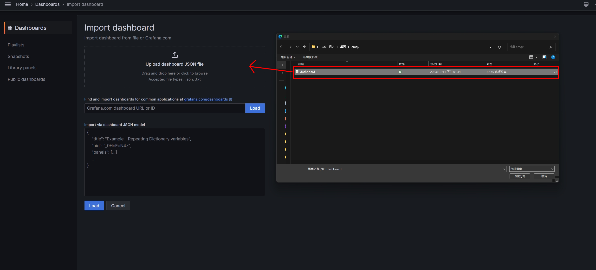
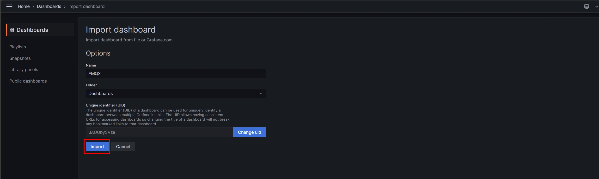

# The best deployment solution for MQTT Broker performance monitoring - EMQX (2)

<!--more-->

## Preface


Before starting to read this article, it is recommended to browse the previous article [High-Performance Internet of Things MQTT Broker - EMQX](https://as183789043.github.io/theme-document-docker-emqx/) to learn about EMQX related information


After successfully establishing EMQX as the brain of MQTT, it is difficult to estimate whether the server can withstand the corresponding resource consumption. By monitoring changes in performance, a chart can provide timely feedback on the current situation. I believe it will allow us to further cope with the risks that will be expected in the future.

But this alone is not as powerful as the title describes. We need an installation method that is different from the past installation method of installing components one by one and then concatenating data. ~~~Let yourself get off work earlier😂~~~

And this will bring up today's protagonist **Docker compose!!**, which is more advanced than Docker, but can deploy multiple Dockers at one time to start all components with one click.

## before the start
Before officially entering our topic today, the tools you will need to prepare are as follows:

* Virtual Machine (Centos, Ubuntu)
*Docker
* Docker Compose
*git


1. For Docker installation, you can refer to [official link](https://docs.docker.com/engine/install/) to choose the appropriate operating system.
2. git installation
    1. ~~~bash
       sudo apt install git #Ubuntu
       ~~~
    2. ~~~bash
       sudo yum install git #Centos
       ~~~
  

## Preliminary steps

1. Grab this file through Git and enter the folder
     ~~~bash
     git clone https://github.com/as183789043/EMQX-Single_Node_Monitor.git
     cd EMQX-Single_Node_Monitor
     ~~~
   
2. Add a new file and modify the permissions (Theoretically, Docker compsoe can be created by yourself, but the author will have permission problems when implementing it, so it is created manually)
     ~~~bash
     mkdir emqx1_data
     chmod 777 emqx1_data
     ~~~

3. Start the file
     ~~~bash
     docker compose up -d
     ~~~
  
At this point, all monitoring components have been successfully started, and we enter the next stage.

## File content description

What exactly is done with the pulled files and the detailed explanation of the program code will be explained in this chapter.
1. docker-compose.yaml
     ~~~yaml
     version: '3'

     services:
       emqx1:
         image: emqx:5.3.2
         container_name: emqx1
         healthcheck:
           test: ["CMD", "/opt/emqx/bin/emqx ctl", "status"]
           interval: 30s
           timeout: 60s
           retries: 5
         ports:
           - 1883:1883
           - 8083:8083
           - 8084:8084
           - 8883:8883
           - 18083:18083
         volumes:
           - ./emqx1_data/:/opt/emqx/data
         networks:
           emqx-bridge:
             aliases:
             - node1.emqx.io

       prometheus:
         image: prom/prometheus
         container_name: prometheus
         volumes:
           - ./prometheus.yaml:/etc/prometheus/prometheus.yaml
         command: --config.file=/etc/prometheus/prometheus.yaml
         ports:
           - 9090:9090
         networks:
           -emqx-bridge

       pushgateway:
         image: prom/pushgateway
         container_name: pushgateway
         ports:
           - 9091:9091
         networks:
           -emqx-bridge
        
       node-exporter:
         image: prom/node-exporter
         container_name: node-exporter
         ports:
           - 9100:9100
         networks:
           -emqx-bridge

       grafana:
         image: grafana/grafana-oss
         container_name: grafana
         ports:
           - 3000:3000
         networks:
           -emqx-bridge

     networks:
       emqx-bridge:
         driver: bridge

     ~~~

     
      version: '3' is the current fixed version of docker compose and can be adjusted according to the official website release
      services: Below are the service names of each component (emqx1, prometheus)
      container_name: The container identification name on the virtual machine
      ports: The former is an external connection port and the latter is an internal port
      volumes: The location where external files are mounted to the container
      networks: The network interface card used, only the same container can communicate with each other
      command: Specify the startup command of the container
      networks > emqx-bridge > driver: Define the network interface card name emqx-bridge to use bridge mode
     

2. prometheus.yaml -> Generated through EMQX web page. Targets can directly write <container name: port> on the same network interface card 
    ~~~yaml
     global:
       scrape_interval: 15s # The default scrape interval is every 10 seconds.
       evaluation_interval: 15s # The default evaluation interval is every 10 seconds.
       # On this machine, every time series will be exported by default.
       external_labels:
         monitor: 'emqx-monitor'

     # Load rules once and periodically evaluate them according to the global 'evaluation_interval'.
     rule_files:
       # - "first.rules"
       # - "second.rules"
       - "/etc/prometheus/rules/*.rules"

     # Data pull configuration
     scrape_configs:
       - job_name: 'node-exporter'
         scrape_interval: 5s
         static_configs:
           # node-exporter IP address and port
           - targets: ['node-exporter:9100']
             labels:
               instance: dashboard-local

     #EMQXPushgateway
     monitoring
       - job_name: 'pushgateway'
         scrape_interval: 5s
         honor_labels: true
         static_configs:
           # Pushgateway IP address and port
           - targets: ['pushgateway:9091']
    ~~~
3. dashboard.json -> as a template configuration file for Garfana dashboard

## Data connection settings
### Important component connection information **You need to change your password when logging in for the first time**
|Service|Port|Username|Password|
| :--- | :--- | :--- | :--- |
|Grafana|3000|admin|public|
|EMQX|18083|admin|admin|

### EMQX push information settings
Note!!Pushgateay needs to enter <container name:port> to transmit data correctly
If you want to generate your own prometheus, you can click **Help** to generate it.

### Grafana setting data source
The previous step pushed EMQX data to Prometheus. Then in Grafana, Prometheus must be set as the source accordingly.

After selecting Prometheus, enter the input connection location

Keep other defaults. Click Save&test and a **green** prompt indicates that the source connection is successful.

### Import template
Follow the path below to click on the import dashboard interface
Home > Dashboards >New > Import dashboard

After confirming the name and Grafana path, click **import**

## Final result
After importing the template successfully, you will see a dashboard similar to the one below

## Conclusion
Although it is a quick deployment, some basic knowledge is required to prepare docker-compose.yaml in the early stage to fully package the container. In this part, the author also tried and made mistakes while packaging.
But on the contrary, such an architecture needs to be reproduced in other environments in the future. It can be restored easily. Save time in the future

In addition, this article focuses on setting up a monitoring system, but Grafana can also issue warnings when specific values are abnormal. I’ll leave the relevant settings for you to explore~~ Class is over!!
