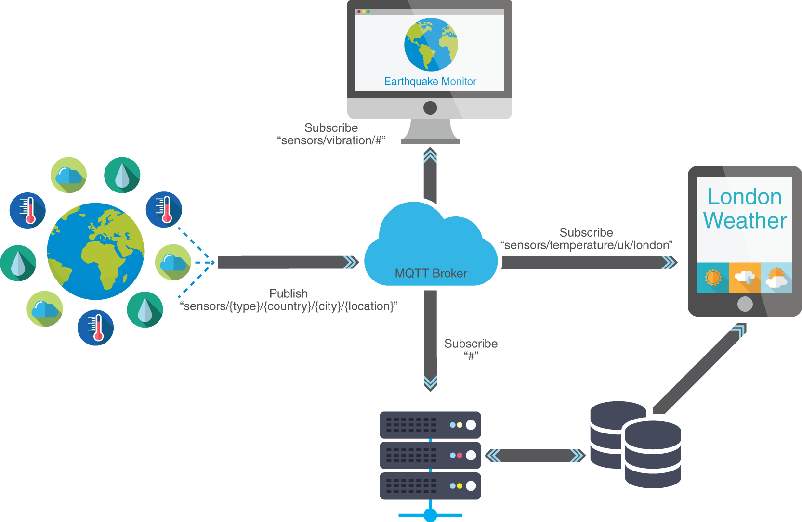
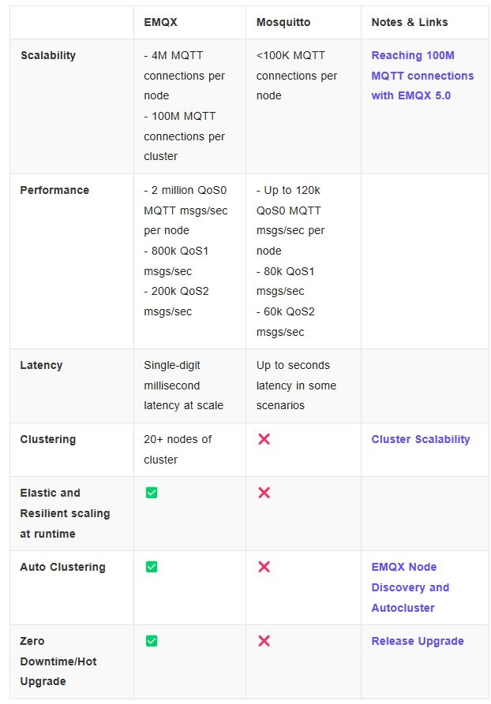
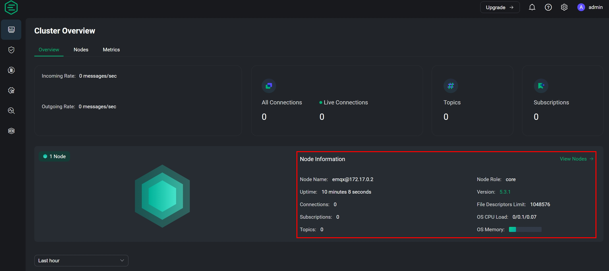
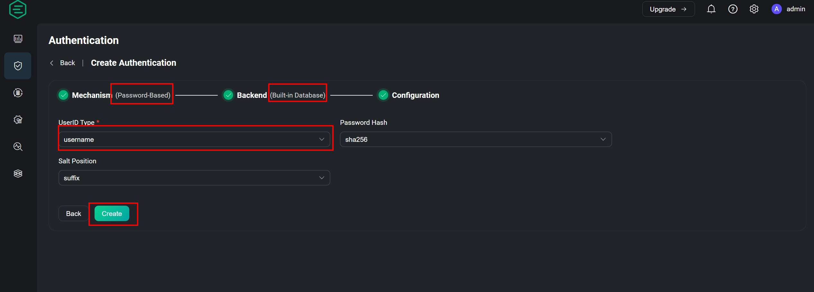
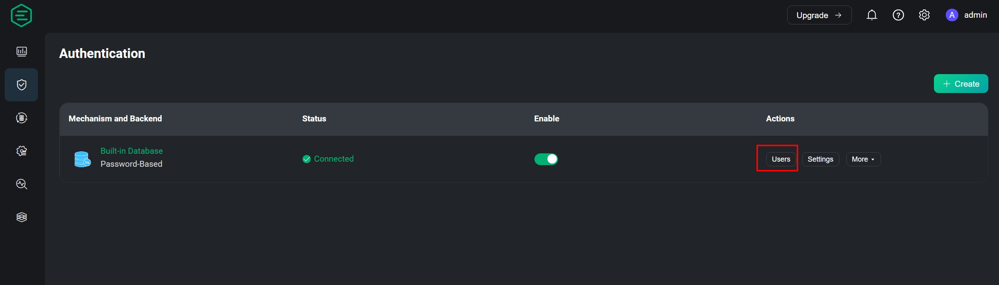
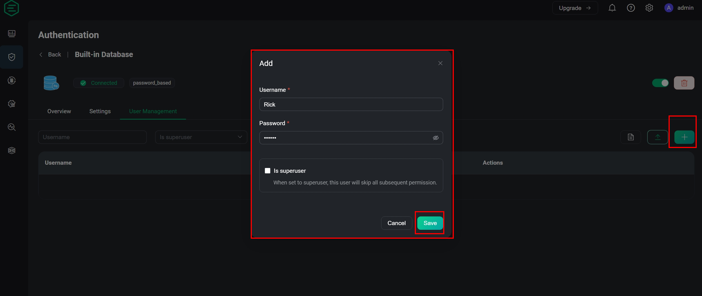
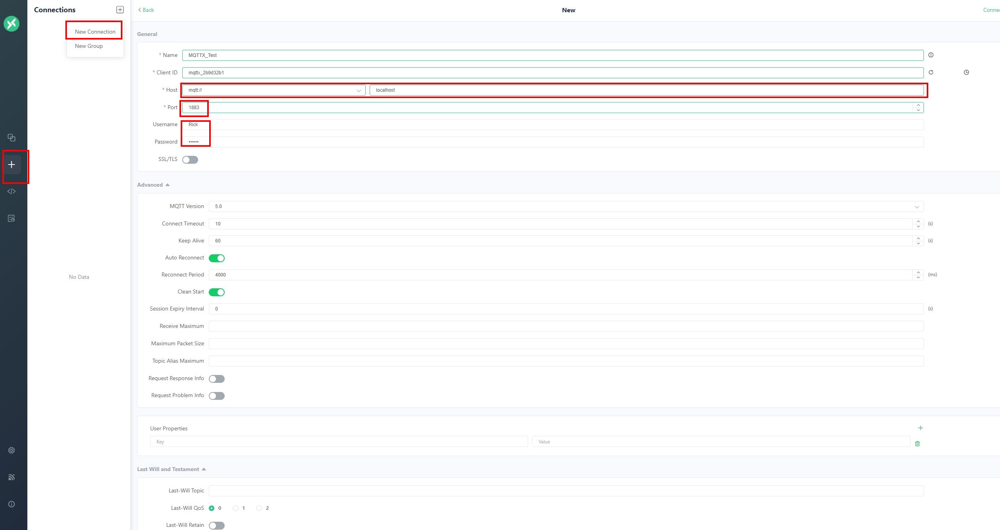
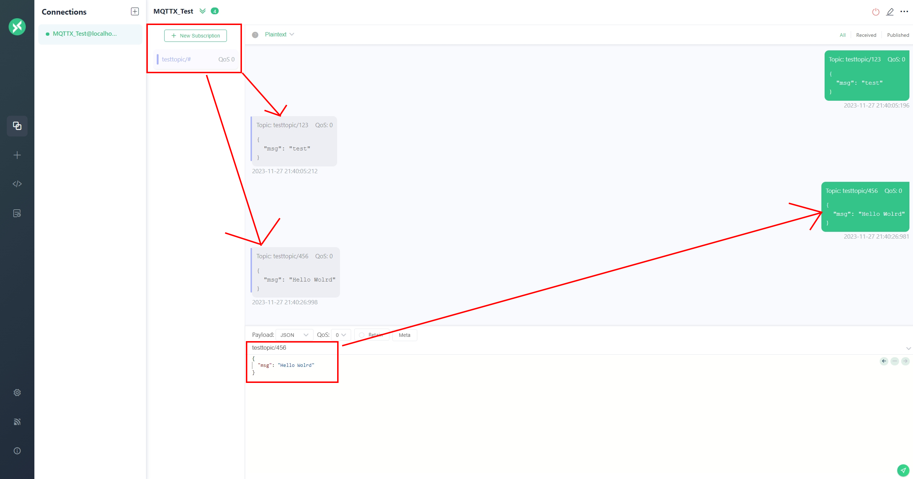
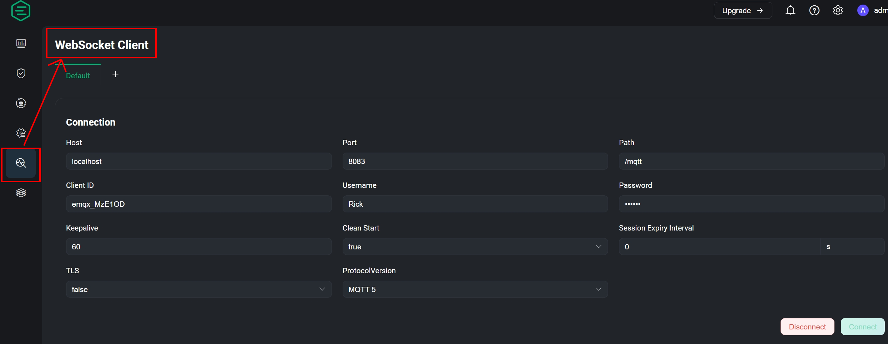
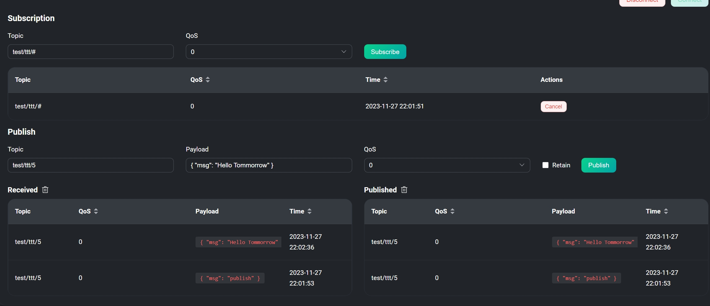

# High-performance IoT MQTT Broker - EMQX


<!--more-->

## Preface

When it comes to the MQTT protocol, the first scenario that most people think of is communication in the Internet of Things. The reason is that MQTT is simpler than the HTTP protocol used on web pages, and the packet messages transmitted are smaller. Ideal for sending and receiving data under limited bandwidth and computing resources. <br>

As for what the specific MQTT protocol is doing, let us look at the picture below to explain.



From the picture, we can see that there is a place similar to the MQTT brain in the middle, generally called the MQTT Broker, where the message publishing (Publish) on the left is transferred to the Subscriber (Subscribe) on the right. This completes a message delivery. <br>

<b>Question: So how do we confirm that publishing and communication can be delivered correctly without getting other noise? </b>

From the picture, you can see that there are some path-like things where each project is connected. This is the so-called topic. Only when publishing and subscribing to the same topic can one receive messages. <br>

If you want to obtain multiple topics, you can set <b>#</b> in the path to read multiple topics, but please note that <b>/</b> represents layering and there is no <b>/ at the beginning of the first layer. </b>


## Differences from similar product Mosquito
The veteran Mosquito must be familiar to enthusiasts who study IoT due to its simple installation method. Allows users to quickly experience how to set up each component of the MQTT protocol. <br>

But in comparison, there are several reasons why I think using EMQX is a good choice.

- Can handle more messaging in a short time
- There is a direct GUI screen for browsing and additional settings
- Internally, data can be dumped out of Prometheus (sequential database) for storage
- If you need to use it on microservice architecture, corresponding installation methods are also provided.

[EMQX vs Mosquitto official website detailed description](https://www.emqx.com/zh/blog/emqx-vs-mosquitto-2023-mqtt-broker-comparison)




## before the start

Before officially entering our topic today, you will need to use the following two tools to demonstrate
-Docker
- [MQTTX](https://mqttx.app/)
  

If you lack a Docker environment, you can read this article [Private environment website monitoring system construction-Uptime-kuma](http://localhost:1313/zh-tw/theme-document-docker-uptime_kuma/#%E7%82%BA% E4%BB%80%E9%BA%BC%E9%9C%80%E8%A6%81%E7%B6%B2%E7%AB%99%E7%9B%A3%E6%8E%A7%E5% Pre-installation requirements in B7%A5%E5%85%B7)!!



## Docker starts EMQX
After installing Docker, enter the following command
```bash
docker run -d --name emqx \
   -p 1883:1883 -p 8083:8083 \
   -p 8084:8084 -p 8883:8883 \
   -p 18083:18083 \
   -v $PWD/data:/opt/emqx/data \
   -v $PWD/log:/opt/emqx/log \
   emqx/emqx:5.3.1
```


- -d: background running
- -p: port mapping (the former is the port on the computer and the latter is the port inside the container)
- -v: Directory mounting for permanent storage ($PWD = current directory of the computer)
- 1883: MQTT standard communication port
- 8083: WebSocket
- 8084: WebSocket with SSL
- 8883: MQTT with SSL
- 18083: Web UI



If there is no EMQX image in the local environment, Docker run will automatically go to Docker Hub to download it. When the instructions on the right are completed, enter [http://lcoalhost:18083](http://localhost:18083 ) to enter the Login Page

Username:admin
Password: public

The first time you log in to the system, you will be prompted to change your password.



## Function exploration

### System information overview
After entering the homepage, the default is Simplified Chinese. You can select the language and black/white mode through the gear in the upper right corner.
The content in the red box shows an overview of system information, such as: system resources, number of MQTT subscriptions, and how many Topics there are currently.


<br>

### Create a User


Create user database


You can see that the user database has been created. Click User to enter the Username to be used after adding it.


There is no account complexity limit for new users


At this point, the necessary information for the connection has been established. We can start to use EMQX through the connection.

## MQTT connection test
Click New Connection and enter the following information
- HOST: MQTT + connection IP (use localhost for this machine)
-Port: 1883
- Username: the account set in the previous section
- Password: the password set in the previous section


After setting up the connection, you need to set the subscription topic first before you can receive the publication later.

Subscribe to topic -> topic/#
Publish topic -> topic/123, topic/456

The red lines in the picture represent which party generated the response (subscription, publishing)

There is a column written by topic/456 above the publish message box in the picture. You can change this to publish different topics.


## WebSocket connection settings


Next, we can publish and subscribe to messages through the bottom of the same page. However, if the message subscription topic is wrong, there will be a situation where the message is sent but not received.


## Chart view
When you return to the home page, you can see that the information you just connected has been organized into a time series chart.
- Incoming Messages refers to the number of published incoming MQTT Broker
- Outgoing Messages refers to the number of incoming subscriptions


## Conclusion
I believe that the above operations can give readers a better understanding of EMQX. For the current environment, having sufficient expansion capabilities is indispensable for bringing the MQTT protocol into reality. This part of the tool has corresponding needs. And it is easy to get started as long as you understand the transfer between MQTT components.

Of course, these are just introductory steps. There will be more advanced operations to explore in the future, such as using middleware for data conversion, integrating with databases, setting up blacklists, etc., which are all left for you to explore.
