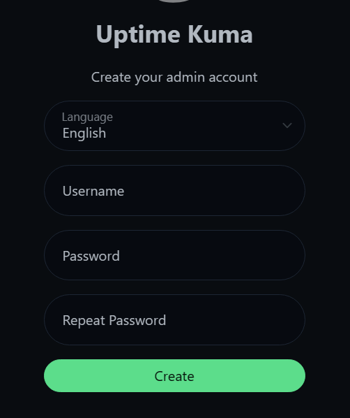
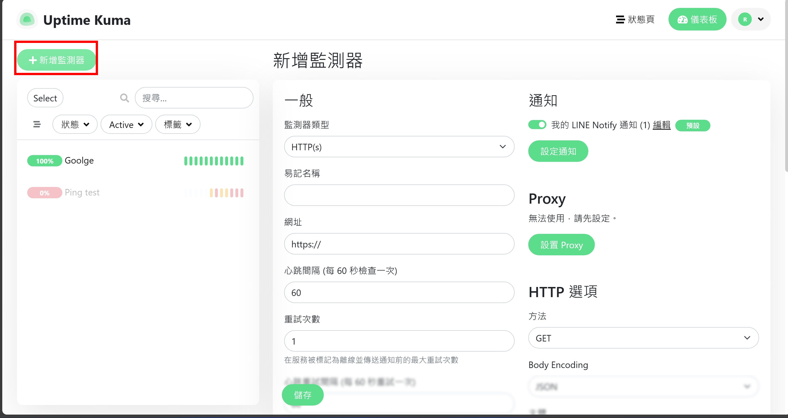
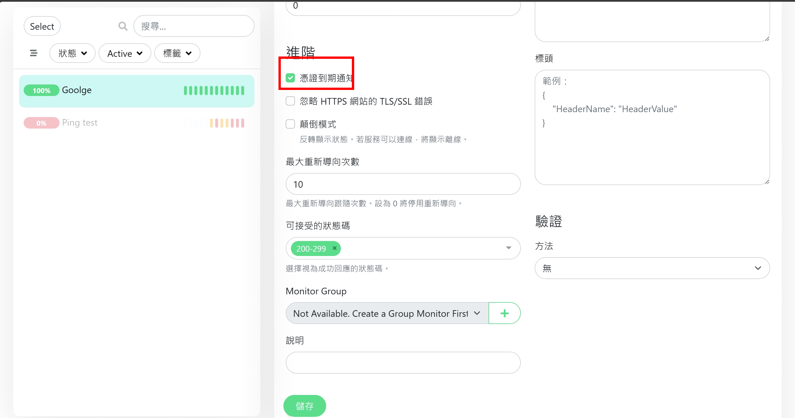
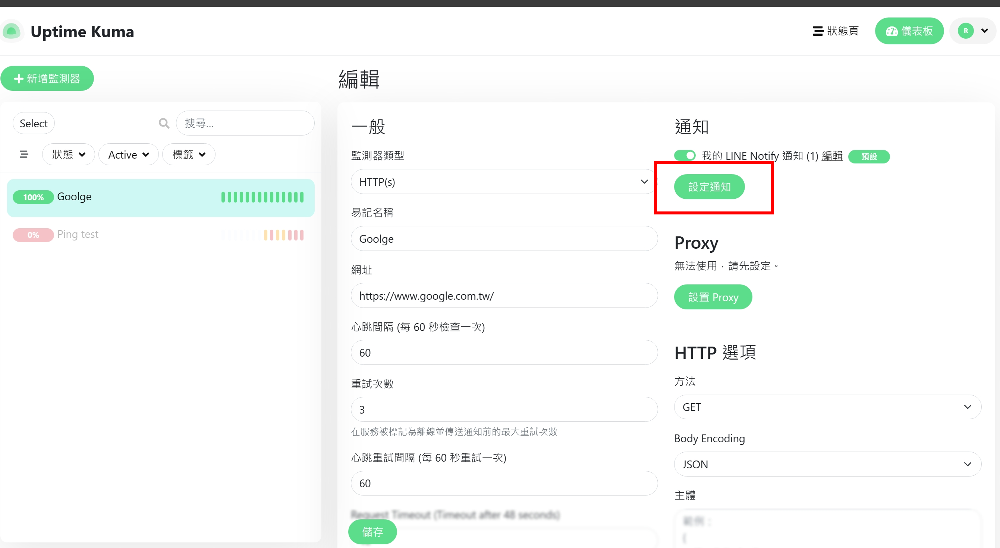
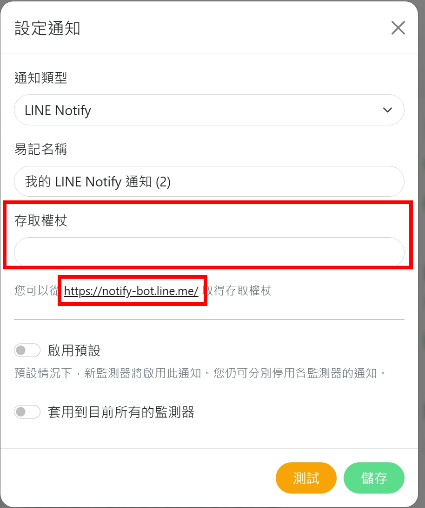
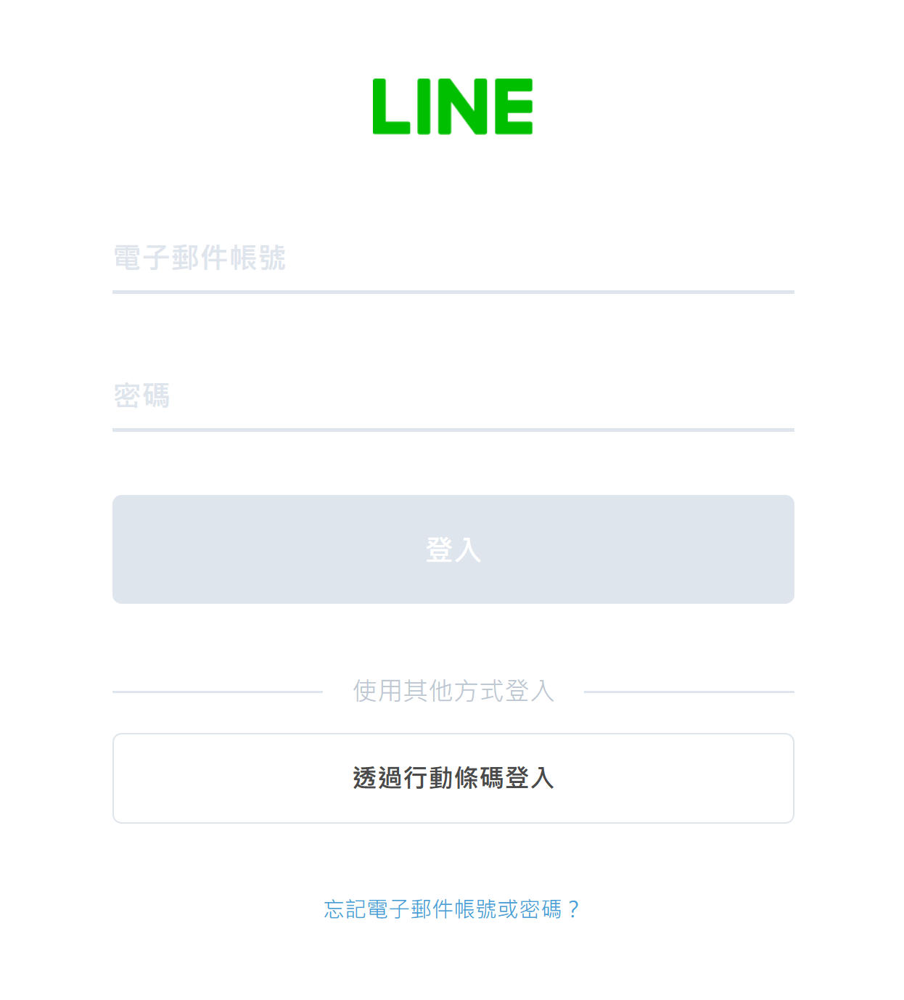
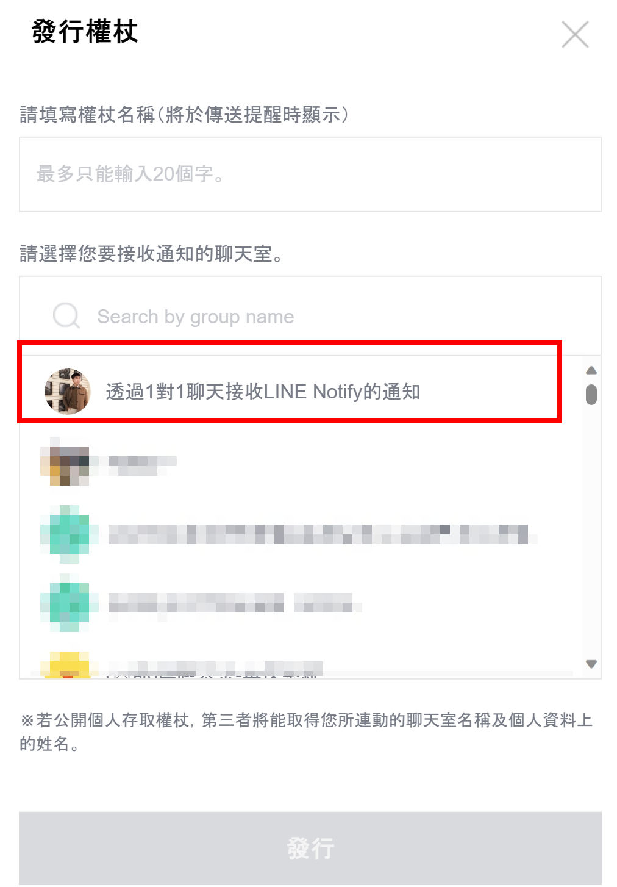
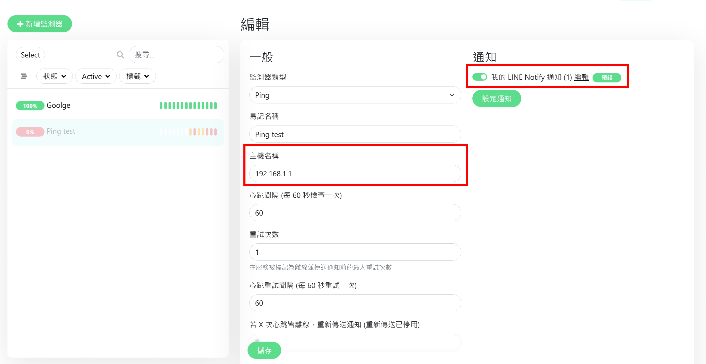
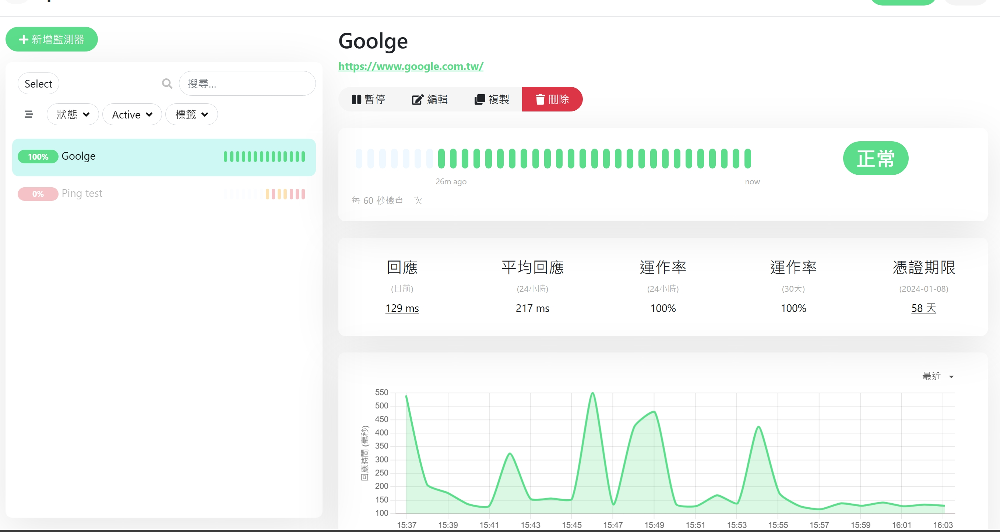
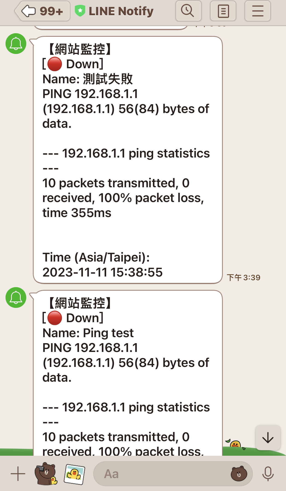

# Sharing good tools - Uptime-kuma

<!--more-->

## Why you need website monitoring tools  

In a general environment where a website is deployed, the most important thing is to know whether the services provided by the website are down or whether the certificate has expired.

 
In the past, these things were monitored by writing scripts or programs, which was extremely troublesome for users without technical background. Especially after the monitoring is written, it also needs to be notified when something goes wrong, which undoubtedly makes reasonable monitoring more troublesome.

   

Adhering to the idea that for complicated things, you should first find ready-made tools online instead of relying on yourself. So there is today’s protagonist Uptime-kuma

 


If you want to experience the online interface and perform basic settings before installation, you can refer to the link below.

[Demo website link 10 minutes available version](https://demo.uptime.kuma.pet)


 
Then let’s start installing it in our own environment to experience the effect of unlimited use.


- An environment with Docker is required (installation method is as follows)
   - Windows
     1. Run PowerShell or Windows Command Prompt as administrator to install WSL and then restart your computer
     ~~~ Powershell
     wsl --install
     ~~~
     2. Download Docker Desktop
   
   - Ubuntu copy and paste in Terminal
     ~~~bash
     sudo apt-get update
     sudo apt-get install \
     ca-certificates\
     curl \
     gnupg\
     lsb-release
     sudo mkdir -m 0755 -p /etc/apt/keyrings
     curl -fsSL https://download.docker.com/linux/ubuntu/gpg | sudo gpg --dearmor -o /etc/apt/keyrings/docker.gpg
     echo \
     "deb [arch=$(dpkg --print-architecture) signed-by=/etc/apt/keyrings/docker.gpg] https://download.docker.com/linux/ubuntu \
     $(lsb_release -cs) stable" | sudo tee /etc/apt/sources.list.d/docker.list > /dev/null
     sudo apt-get update
     sudo apt-get install docker-ce docker-ce-cli containerd.io docker-buildx-plugin docker-compose-plugin -y
     sudo gpasswd -a $USER docker
     newgrp docker
     ~~~


## Uptime-kuma installation

Enter Power Shell/Terminal and enter the following command
~~~docker
docker run -d --restart=always -p 3001:3001 -v uptime-kuma:/app/data --name uptime-kuma louislam/uptime-kuma:1
~~~


   >- -d will make the container run in the background
   >- -restart starts docker and automatically starts monitoring
   >- -p The internal network port corresponds to the external (host) port number
   >- -v data storage location Add uptime-kuma folder to the current directory of the machine to synchronize the app/data directory of the container


### Connection UI interface

If you want to experience the online interface and perform basic settings before installation, you can refer to the link below.
~~~
http://localhost:3001
~~~
If Ubuntu does not have a desktop installed, you can refer to the following methods
~~~bash
   ufw allow 3001 #Open external firewall
   ip -a #Find the IP of the current host and then use an external connection to enter
~~~


## UI settings
Entering the UI requires setting an account and password.

Start with the simplest web page monitoring

Enter the URL to be monitored

If you have advanced needs, you can also check the box to check the remaining days of the voucher.

## Alarm system Line Notify settings
Can set more than one notification

When you see that a token is required and there are instructions below on how to get it, click on the URL in the red box below.

Click on the upper right corner

You can choose to log in with an account or qrcode

You can choose how notification is sent. It can be directed to individuals or in groups. Test first to see the effect on 1-on-1 basis.

After logging in, scroll to the bottom and click Issue Token

Just get the token and fill it back into the web page

## Simulation monitoring failure example
The configuration file of Ping is as follows. The type of ping and simulation of a non-existent URL are combined with notification settings.

## result
It can be seen that the website's response time is 0.2 seconds on average, the response rate is normal and the certificate expires in 58 days.

If it fails, a message will be sent

## References
[Official Github](https://github.com/louislam/uptime-kuma)
