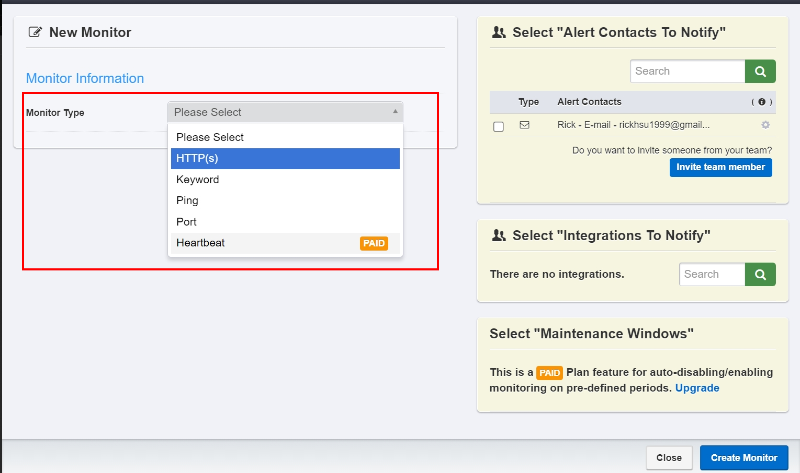
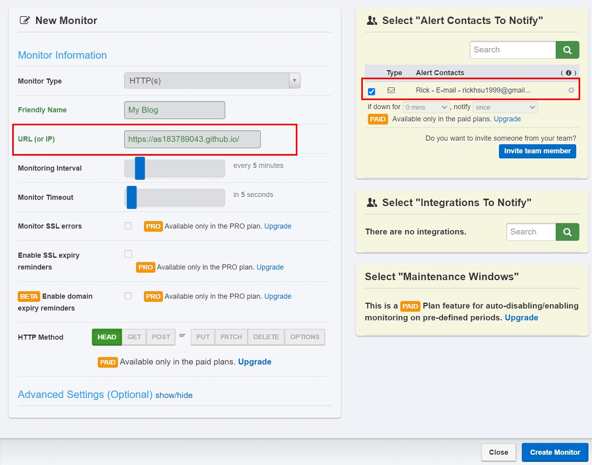

# Free online web monitoring service - UptimeRobot

<!--more-->

## Preface
This article is a continuation of the previous one
[Private environment website monitoring system construction - Uptime-kuma](http://localhost:1313/zh-tw/theme-document-docker-uptime_kuma/) The following content

The difference between the two is that if the service that needs to be monitored can already be connected through the browser and you do not plan to set up a local monitoring system yourself, UptimeRobot will come in handy!!

 

## Free version restrictions
The picture below is taken from the cover of the official website. Under free usage conditions, 50 monitoring targets can be set and a check will be performed every 5 minutes.

## Registration steps

[Official website registration link](https://uptimerobot.com/signUp?ref=website-header)
 
Enter registration information

Go to your mailbox to activate your account

  
## Add monitoring target


In the subsequent settings, you will see *PAID*, which are benefits that need to be upgraded to enjoy.


The mailbox jumps to the homepage of UptimeRobot. You can see that there is a mobile version available for download (~~~No need to carry a computer with you anytime and anywhere 😂~~~) Then click +Add New Monitor

Select monitoring type

Let’s take the blog’s survival status as an example for setting up (please expand the info block for detailed setting instructions)


URL(IP) IP exposed on the public network that can be connected  
Monitoring Interval: The checking interval can be greater than 5 minutes but not less (needs to be upgraded)  
Monitor Timeout: Check how long it has been since there was no response to determine if it is abnormal  


## Tests and results
After the setting is completed, you can check whether the setting is correct through testing.

Go back to the mailbox to check. The service is normal, but the time zone is abnormal.

 
Change the time zone setting (after testing, the email time zone is normal and the dashboard is still UTC+0)

## in conclusion

Compared with the self-built service version, it lacks some common functions, such as the following
- No SSL certificate expiry detection
- The default email of the notification system requires additional settings and cannot be supported by Line commonly used in Taiwan.
  
But since it is free, some missing features are within reasonable limits. To use it, you need to choose whether to use this tool according to the scene area!
 
In addition, the difference in benefits before and after the upgrade is attached for readers’ reference.
[UptimeRobot-Pricing](https://app.uptimerobot.com/billing/pricing/)

## Additional screening on the same scene, mobile APP screen browsing
After downloading the mobile APP, you can check the status of the website through the time and time on your mobile phone, and there will be an additional mobile notification option (needs to be opened in Alert)

Let me end this article by showing you the mobile version.

