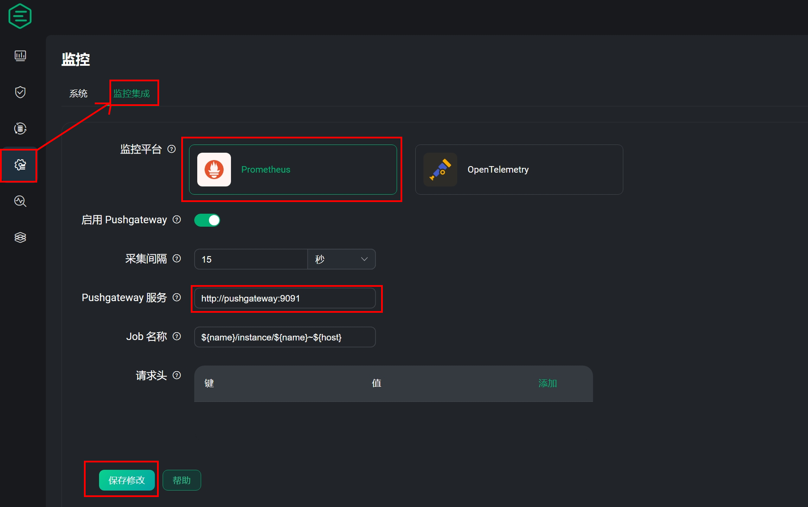
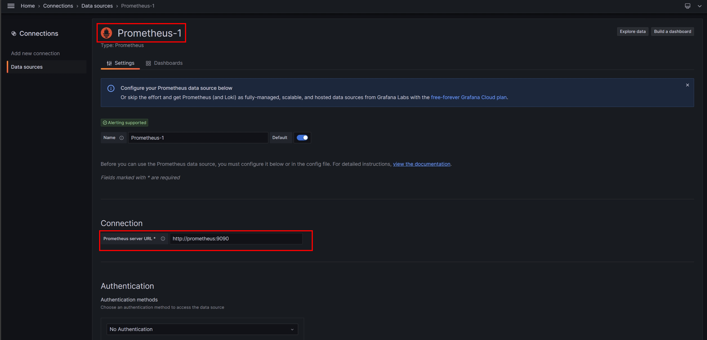
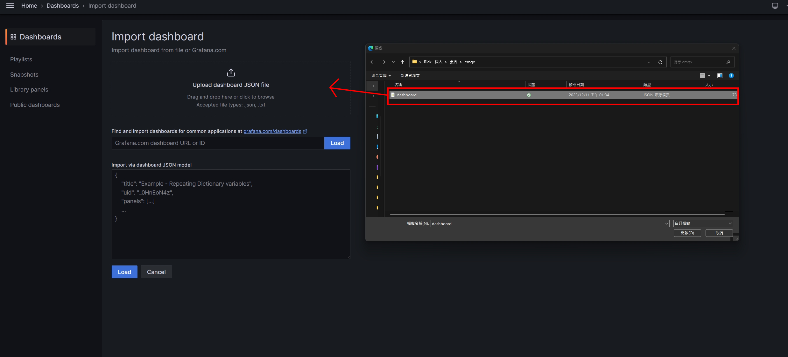
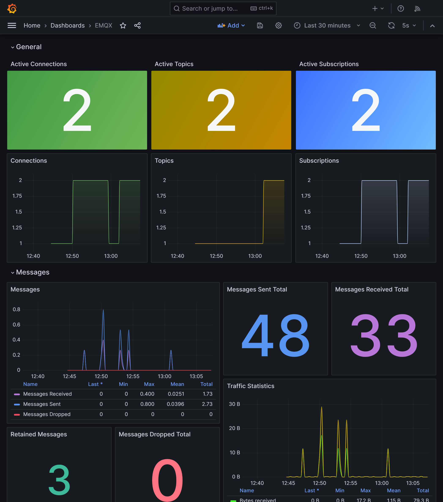

# MQTT Broker 性能监控最佳布建方案 - EMQX(二)

<!--more-->

## 前言


在开始阅读本文前 建议先浏览前篇文章 [高性能物联网MQTT Broker - EMQX](https://as183789043.github.io/theme-document-docker-emqx/) 了解EMQX相关资讯


成功建立EMQX来作为MQTT的大脑之后 ，对于Server是否能承受相应的资源消耗是一个难以估量的场景，而透过监控性能上的变化，再由一个能及时反馈当前状况的图表。相信能够让我们更进一步的去应对接下来会预期到的风险。

但仅仅是如此还不能达到像标题描述的那么厉害，我们需要一个有别于过去一个个组件安装完成再进行资料串接的安装方式。 ~~~让自己可以更早下班😂~~~ 

而这就会提到今天的主角 **Docker compose !!** ，比Docker再更进阶一些，但是可以一次部署多个Docker来达到一键启动所有组件

## 开始之前
在正式进入我们今日主题之前，会需要准备的工具如下  

* Virtual Machine (Centos,Ubuntu)
* Docker 
* Docker Compose 
* git


1. Docker安装可以参照[官方连结](https://docs.docker.com/engine/install/)选择合适的作业系统
2. git 安装
   1. ~~~bash
      sudo apt install git   #Ubuntu
      ~~~
   2. ~~~bash
      sudo yum install git   #Centos
      ~~~
 

## 前置步骤

1. 透过Git抓取本次档案 并进入该资料夹
    ~~~bash
    git clone https://github.com/as183789043/EMQX-Single_Node_Monitor.git
    cd EMQX-Single_Node_Monitor
    ~~~
   
2. 新增档案并修改权限 (理论上Docker compsoe 可以自己建立，但笔者实作时会有权限问题，故改为手动建立)
    ~~~bash
    mkdir emqx1_data
    chmod 777 emqx1_data
    ~~~

3. 启动档案
    ~~~bash
    docker compose up -d
    ~~~
  
到这里就成功将所有监控组件启动了，我们进入下一阶段

## 档案内容说明

对于拉取下来的档案具体做了哪些事情，以及程式码的细部讲解都会在这个章节进行说明
1. docker-compose.yaml
    ~~~yaml
    version: '3'

    services:
      emqx1:
        image: emqx:5.3.2
        container_name: emqx1
        healthcheck:
          test: ["CMD", "/opt/emqx/bin/emqx ctl", "status"]
          interval: 30s
          timeout: 60s
          retries: 5
        ports:
          - 1883:1883
          - 8083:8083
          - 8084:8084
          - 8883:8883
          - 18083:18083 
        volumes:
          - ./emqx1_data/:/opt/emqx/data
        networks:
          emqx-bridge:
            aliases:
            - node1.emqx.io

      prometheus:
        image: prom/prometheus
        container_name: prometheus
        volumes:
          - ./prometheus.yaml:/etc/prometheus/prometheus.yaml
        command: --config.file=/etc/prometheus/prometheus.yaml
        ports:
          - 9090:9090
        networks:
          - emqx-bridge

      pushgateway:
        image: prom/pushgateway
        container_name: pushgateway
        ports:
          - 9091:9091
        networks:
          - emqx-bridge
        
      node-exporter:
        image: prom/node-exporter
        container_name: node-exporter
        ports:
          - 9100:9100
        networks:
          - emqx-bridge

      grafana:
        image: grafana/grafana-oss
        container_name: grafana
        ports:
          - 3000:3000
        networks:
          - emqx-bridge

    networks:
      emqx-bridge:
        driver: bridge

    ~~~

    
     version  : '3' 是目前docker compose的固定版本 可根据官网发布进行调整  
     services : 底下是各个组件的服务名称(emqx1、prometheus) 
     container_name : 在虚拟机上的容器识别名称
     ports    : 前者是外部连线port 后者是内部port
     volumes  : 外部文件挂载到容器的位置 
     networks : 使用的网卡，同一张容器才会互通 
     command  : 指定容器的启动命令
     networks > emqx-bridge > driver : 定义网卡名为emqx-bridge 使用桥接模式
    

2. prometheus.yaml  -> 透过EMQX网页生成。 Targets在同一张网卡可以直接写<容器名称:port>
   ~~~yaml
    global:
      scrape_interval:     15s # The default scrape interval is every 10 seconds.
      evaluation_interval: 15s # The default evaluation interval is every 10 seconds.
      # On this machine, every time series will be exported by default.
      external_labels:
        monitor: 'emqx-monitor'

    # Load rules once and periodically evaluate them according to the global 'evaluation_interval'.
    rule_files:
      # - "first.rules"
      # - "second.rules"
      - "/etc/prometheus/rules/*.rules"

    # Data pull configuration
    scrape_configs:
      - job_name: 'node-exporter'
        scrape_interval: 5s
        static_configs:
          # node-exporter IP address and port
          - targets: ['node-exporter:9100']
            labels:
              instance: dashboard-local

    # EMQX Pushgateway monitoring
      - job_name: 'pushgateway'
        scrape_interval: 5s
        honor_labels: true
        static_configs:
          # Pushgateway IP address and port
          - targets: ['pushgateway:9091']
   ~~~
3. dashboard.json ->作为 Garfana仪表板之模板设定档

## 资料串接设定
### 重要组件连线资讯 **第一次登入要修改密码**
|Service|Port|Username|Password|
| :--- | :--- | :--- | :--- |
|Grafana|3000|admin|public|
|EMQX|18083|admin|admin|  

### EMQX推送资讯设定
注意!!Pushgateay要输入 <容器名称:port>才能正确传输资料 
如果要生成自己的prometheus可以点选**帮助**来产生

### Grafana 设定资料来源
上一步骤将EMQX资料推至Prometheus。那么在Grafana就要相应的将Prometheus设置为来源

选择Prometheus后输入输入连线位置

其他保持预设 点选Save&test有**绿色**提示代表来源连接成功

### 汇入模板
依照以下路径点选至汇入仪表板介面
Home > Dashboards >New  > Import dashboard

确定名称及所属Grafana路径后点选 **import**

##  最后结果
汇入模板成功，就会看到一个类似下图的仪表板

## 结语
虽然是快速部署，但在前期准备docker-compose.yaml会需要一些基础知识，才能够将容器进行完整打包。这部分笔者也是一边试错，一边打包。
但相对的，未来在其他环境需要重现这样的架构。就可以轻松的还原。节省未来花费的时间

另外是本篇文章著重架设监控系统，但Grafana还可以针对特定数值异常时发出警告。相关设定就留给各位去探索啰~~ 下课!!
