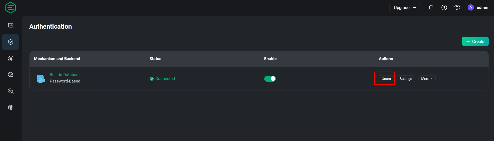
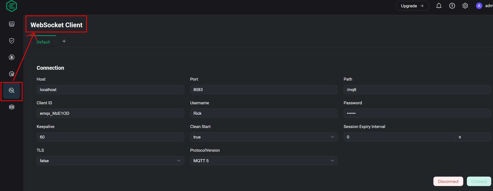
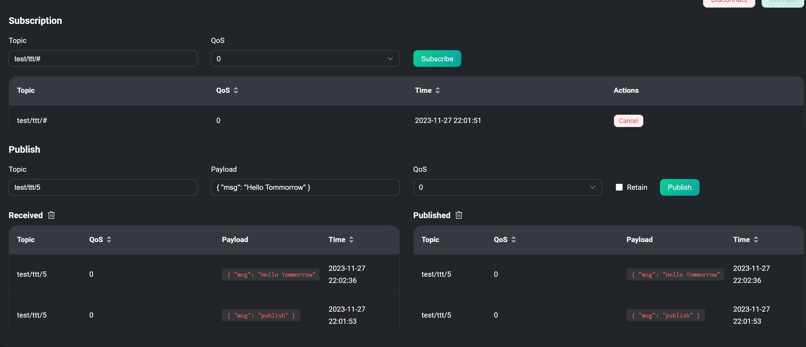

# 高性能物联网MQTT Broker - EMQX


<!--more-->

## 前言

提到MQTT协定，大多数人第一个想到的场景应该是在物联网的通讯之中，其中原因在于MQTT相比网页上使用的HTTP协定来的更简便，传输的封包讯息也更小。非常适用于在有限频宽和计算资源的状况下收发资料。 <br>

至于MQTT具体协议是在做什么 就让我们看下方的图来说明



从图中我们可以看到 正中间有一个类似MQTT大脑的地方，一般称之为MQTT Broker， 这里会将左边的讯息发布(Publish) 转送到右边的订阅者(Subscribe)手上。这样就完成了一次消息的传递。 <br>

<b>问题: 那么我们怎么确认发布与通讯可以正确传递，但又不会拿到其他的杂讯? </b>

从图中可以看到各个项目连接的地方有一些类似路径的东西，这个是所谓的主题(Topic)，发布与订阅在同一个主题才能接收到讯息。 <br>

如果想取得多个主题可以在路径中设置<b>#</b> 来进行多主题读取，但需要注意<b>/</b>代表分层且第一层开头没有<b>/ </b>


## 与相似产品Mosquito的差异
老牌的Mosquito对于有研究IoT的爱好者来说，想必不陌生，其简单的安装方式。让使用者可以快速体验MQTT协议的各个组件如何设置。 <br>

但相较之下有以下几个理由令我觉得使用EMQX也不失为一个好选择。

- 短时间可以处理更多的消息传递
- 直接有GUI画面可以进行浏览和额外设置
- 内部可以将数据倒出Prometheus(时序性资料库)进行存储
- 如果需要使用在微务架构上，也有提供相应的安装方式

[EMQX vs Mosquitto 官网详细说明](https://www.emqx.com/zh/blog/emqx-vs-mosquitto-2023-mqtt-broker-comparison)


## 开始之前

在正式进入我们今日主题之前，会需要使用以下两项工具来演示 
- Docker
- [MQTTX](https://mqttx.app/) 
  

如果缺少Docker环境可以看这篇[私有环境网站监控系统建置- Uptime-kuma](https://as183789043.github.io/zh-cn/theme-document-docker-uptime_kuma/#%E4%B8%BA%E4%BB%80%E4%B9%88%E9%9C%80%E8%A6%81%E7%BD%91%E7%AB%99%E7%9B%91%E6%8E%A7%E5%B7%A5%E5%85%B7)中的安装前置需求!!



## Docker启动EMQX
安装好Docker之后输入以下指令 
```bash
docker run -d --name emqx \
  -p 1883:1883 -p 8083:8083 \
  -p 8084:8084 -p 8883:8883 \
  -p 18083:18083 \
  -v $PWD/data:/opt/emqx/data \
  -v $PWD/log:/opt/emqx/log \
  emqx/emqx:5.3.1
```


- -d : 背景运行  
- -p : 端口mapping(前者是电脑本的port 后者是容器内部的port)  
- -v : 目录挂载进行永久化存储($PWD = 电脑当前目录)
- 1883 : MQTT标准通信Port
- 8083 : WebSocket 
- 8084 : 具有SSL 的 WebSocket
- 8883 : 具有SSL 的 MQTT
- 18083 : Web UI



本地环境如果没有EMQX的image，Docker run 会自动到Docker Hub 上去下载，看到如右侧的指令跑完，在浏览器上输入[http://lcoalhost:18083](http://localhost:18083)即可进入Login Page 

Username : admin  
Password : public

第一次登系统会提示修改密码
  


## 功能探索

### 系统资讯概览
进入首页后预设简体中文，可以透过右上角齿轮选择语言 和黑/白模式
红框中的内容可以看到系统的资讯概览，例如:系统资源、MQTT订阅数量、目前有多少Topic
 

<br>

### 建立一个User


建立用户资料库


可以看到用户资料库已经建立，点选User 进入里面新增之后要用的Username


新的user没有帐号复杂度限制  


至此已经建立了连线的必备资讯，我们可以开始透过连线来使用EMQX了

## MQTT连线测试
点选新连线输入以下资讯
- HOST : MQTT + 连线IP(本机用localhost)
- Port : 1883
- Username : 上一小节设定的帐号
- Password : 上一小节设定的密码 


设定好连线后需要先设定订阅主题 后续才能收到发布  

订阅主题 -> topic/#  
发布主题 -> topic/123、topic/456  

图片中的红线代表着分别是哪一方产生的回应(订阅、发布)

图片中发布讯息框上面有一个写者 topic/456 的栏位 更改这里可以发布不同主题 


## WebSocket 连线设定


接下来我们可以透过同一个页面的下方发布和订阅消息，但如果消息订阅主题错误，会产生有送出但没收到的状况


## 图表检视
回到首页可以看见刚才进行连线的资讯已经整理成时序性图表呈现  
- Incoming Messages 指的是发布传入MQTT Broker的数量
- Outgoing Messages 指的是传入订阅的数量


## 结语
相信上述的操作能让读者对EMQX有更进一步的认识，对于现在的环境来说，具有足够好的扩展能力对于将MQTT协议带入现实能力式不可少的。而这部分在此工具都有相应的满足需求。且操作下来只要有了解MQTT组件间的传递就很容易上手。

当然这些只是入门，后续还会有更进阶的操作可以发掘，比如使用中间件进行数据转换，与资料库整合、设置黑名单等等功能 就留给各位去探索了
