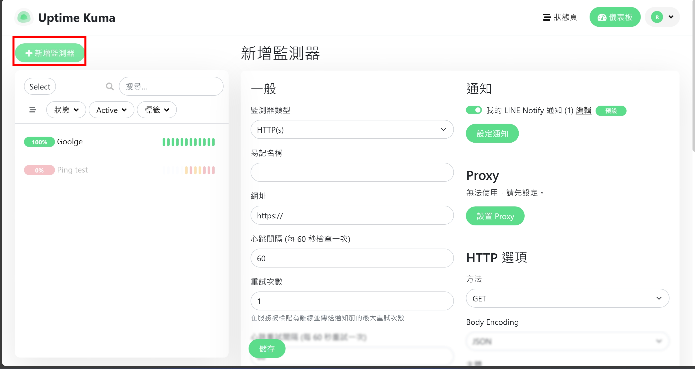
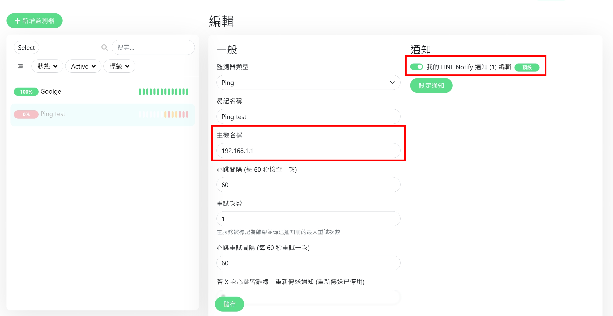

# 私有环境网站监控系统建置 - Uptime-kuma

<!--more-->

## 为什么需要网站监控工具    

在一般有部署网站的环境中，最重要的就是知道现在网站提供的服务有没有挂掉或是凭证有没有到期    

 
而这些事情在过去都是透过编写脚本或程式来进行监控，对于没有技术背景的使用者来说，异常麻烦。尤其是监控写好了 还要能在出状况时进行通知 无疑是让合理的监控变得更麻烦   

  

秉持着 复杂的事情先上网找现成工具没有再靠自己的想法。所以就有了今天的主角 Uptime-kuma  

 


如果想在安装前先体验线上版介面和进行基础的设定可以参考下方连结

[Demo 网站连结 10 分钟可用版](https://demo.uptime.kuma.pet)  


  
那么 我们就开始安装在自己环境中来体验无期限使用的效果吧  

 
- 需要一台有Docker 的环境  (安装方法如下)
  - Windows
    1. 以管理员身份运行 PowerShell 或 Windows 命令提示符 安装WSL 然后重启电脑
    ~~~ Powershell
    wsl --install
    ~~~
    2. 下载Docker Desktop
  
  - Ubuntu 复制贴上在Terminal 即可
    ~~~bash
    sudo apt-get update
    sudo apt-get install \
    ca-certificates \
    curl \
    gnupg \
    lsb-release
    sudo mkdir -m 0755 -p /etc/apt/keyrings
    curl -fsSL https://download.docker.com/linux/ubuntu/gpg | sudo gpg --dearmor -o /etc/apt/keyrings/docker.gpg
    echo \
    "deb [arch=$(dpkg --print-architecture) signed-by=/etc/apt/keyrings/docker.gpg] https://download.docker.com/linux/ubuntu \
    $(lsb_release -cs) stable" | sudo tee /etc/apt/sources.list.d/docker.list > /dev/null
    sudo apt-get update
    sudo apt-get install docker-ce docker-ce-cli containerd.io docker-buildx-plugin docker-compose-plugin -y
    sudo gpasswd -a $USER docker 
    newgrp docker
    ~~~


## Uptime-kuma安装

进入Power Shell / Terminal 输入以下指令
~~~docker
docker run -d --restart=always -p 3001:3001 -v uptime-kuma:/app/data --name uptime-kuma louislam/uptime-kuma:1
~~~

 
  >- -d 会让容器在背景运行 
  >- -restart 开机启动docker自动启动监控
  >- -p 内部的网路端口对应到外部(主机)的端口号
  >- -v 资料储存位置 本机的当前目录新增uptime-kuma资料夹 同步容器的app/data 目录
 

### 连线UI介面

如果想在安装前先体验线上版介面和进行基础的设定可以参考下方连结
~~~
http://localhost:3001
~~~
如果Ubuntu没有装桌面的话 可以参考以下方法
~~~bash
  ufw allow 3001 #打开对外防火墙
  ip  -a  #找出当前主机的ip 再用外部连线进入
~~~


## UI设定
进入UI需要设定帐号密码   
  

从最简单的网页监测开始    
  
输入要监控的网址

  
如果有进阶需求 如查看凭证剩余天数也可以勾选    
  

## 告警系统 Line Notify 设定
可以设定不只一个通知  
  
看到需要token 且下方有教学如何从哪里取的 点选下方红框中的网址
  
点选右上角  
  
可选择用帐号还是qrcode登入  
  
可选择notify如何发送通知可以是指针对本人或是在群组中发出  测试先用1对1看效果  
  

登入后滑到最下方 点选发行权杖  
  
取得token回填网页即可  
  

## 模拟监控失败范例
Ping 的设定档如下 ping的类型和 模拟一个不存在的网址 再配上通知设定  

## 结果
可以看到网站的回应时间平均在0.2秒，回应率正常且凭证在58天后到期  

如果失败会发出讯息  

## 参考资料
[官方Github](https://github.com/louislam/uptime-kuma)
