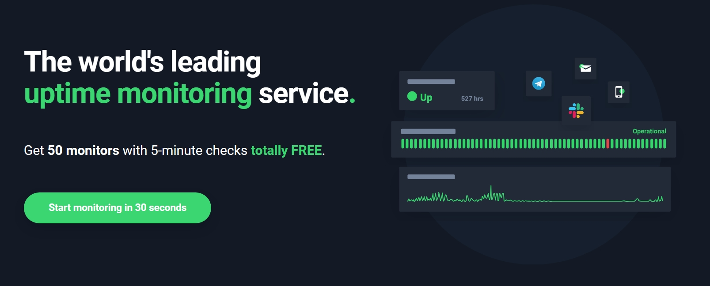
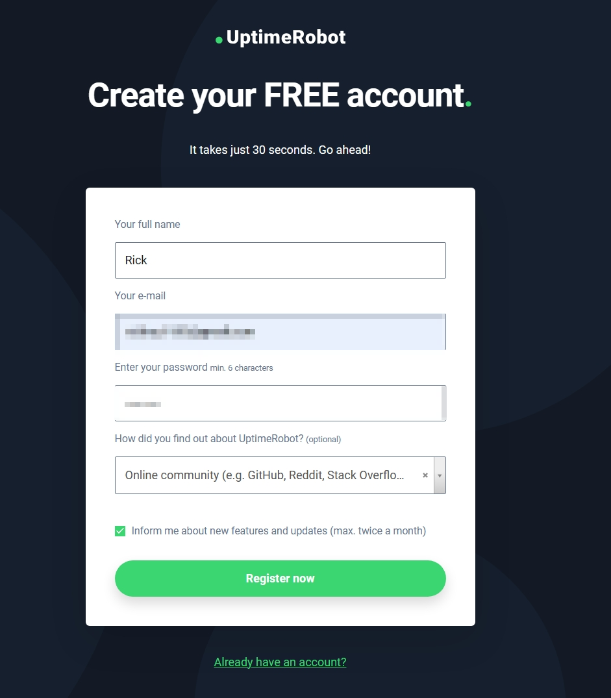
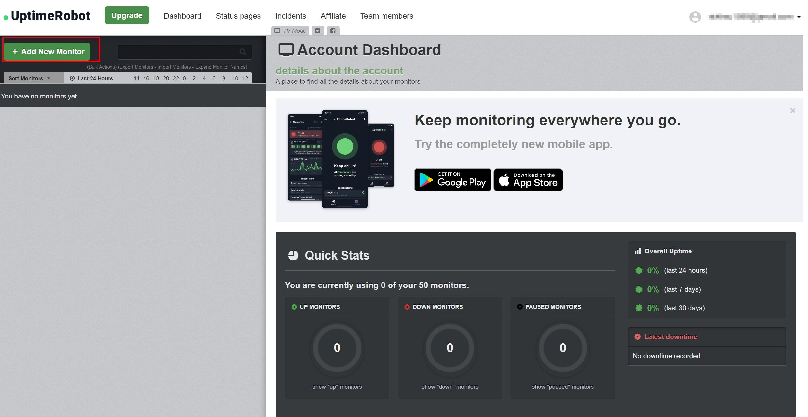
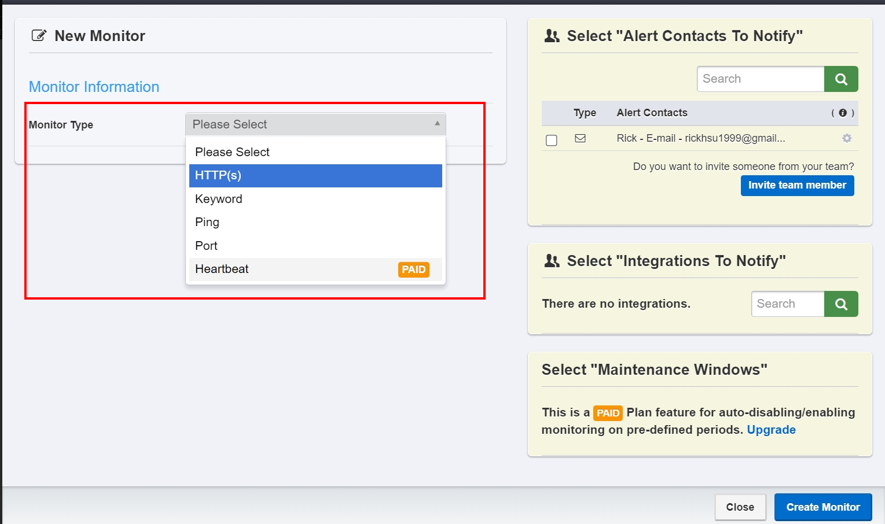
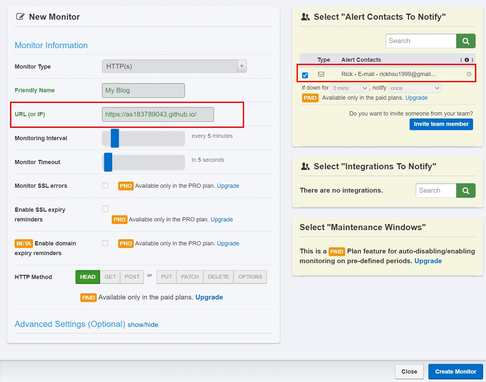
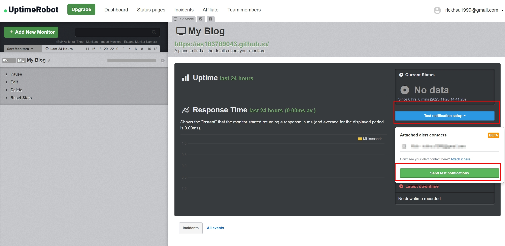

# 免费线上网页监控服务 - UptimeRobot

<!--more-->

## 前言
此篇文章为接续上篇 
[私有环境网站监控系统建置 - Uptime-kuma](http://localhost:1313/zh-tw/theme-document-docker-uptime_kuma/) 之后续内容 

两者区别在于如果需要监控的服务已经可以透过浏览器连上 且不打算自己在本地架设监控系统的状况下 就有UptimeRobot的用武之地了!!  

 

## 免费版限制
下图是从官方网站上的封面取得，在免费的使用条件下可以设置50个监控目标，每5分钟进行一次检查
  

## 注册步骤

[官网注册连结](https://uptimerobot.com/signUp?ref=website-header) 
 
输入注册资讯  
 

到信箱启用帐户 
 

  
## 新增监控目标  


后续设定中看到有 *PAID* 都是需要升级才能享有的权益
 

信箱跳转到首页UptimeRobot首页 可以看到有手机版可以下载(~~~不用随时随地都带着电脑了😂~~~) 接着点选+Add New Monitor 
 

选择监控类型

进行设定以部落格存活状况为例 (详细设定说明可展开info区块)   

   


URL(IP) 暴露在公网可以连线的IP   
Monitoring Interval : 检查的间隔 可以大于5分钟 但不能小于(要升级)  
Monitor Timeout : 检查当下多久没回应判定异常  
 

## 测试与结果
设定完成可以透过测试来检查设定是否正确  
  
 
回到信箱查看 服务正常，但时区异常   
 
 
更改时区设定 (测试后信件时区正常，仪表板仍为UTC+0)

## 结论

与自建服务版本相比缺少一些常用功能 比如以下
- 没有SSL凭证到期检测
- 通知系统预设Email 其他需要额外设定且台湾常用的Line无法支援
  
但既然是免费的 有一些功能缺少也在合理范围内。使用上就需要依场景区选择是否使用这项工具!  
 
另外附上升级前后的权益差别供各位读者参考 
[UptimeRobot-Pricing](https://app.uptimerobot.com/billing/pricing/)

## 同场加映 手机APP画面浏览
下载手机APP后可以透过手机 来及时间了解网站状况 且会多出一个手机通知选项(需要在Alert中打开)

给各位看一下手机版的版面来当作本文的结尾

