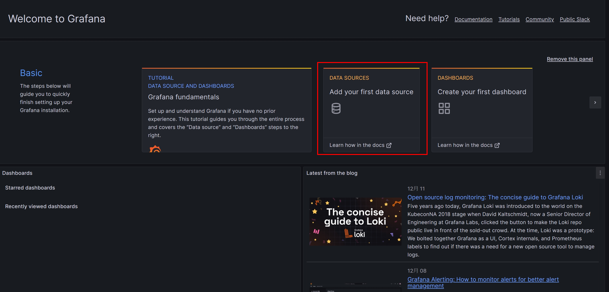
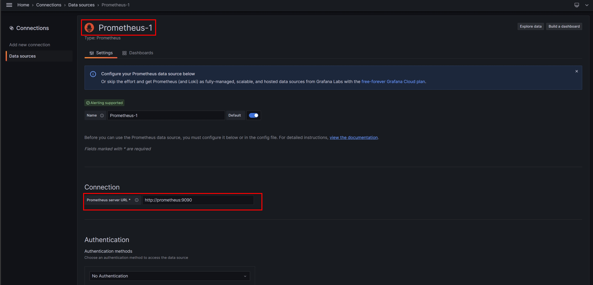
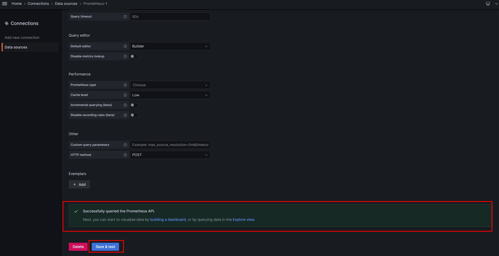
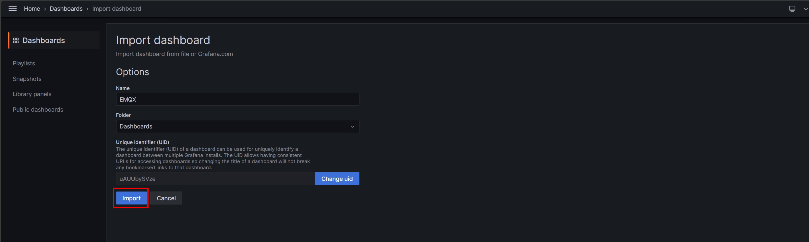
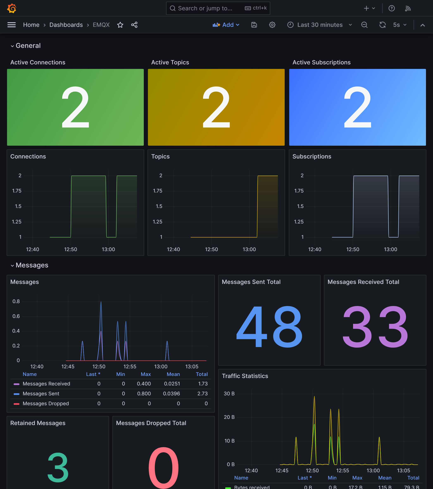
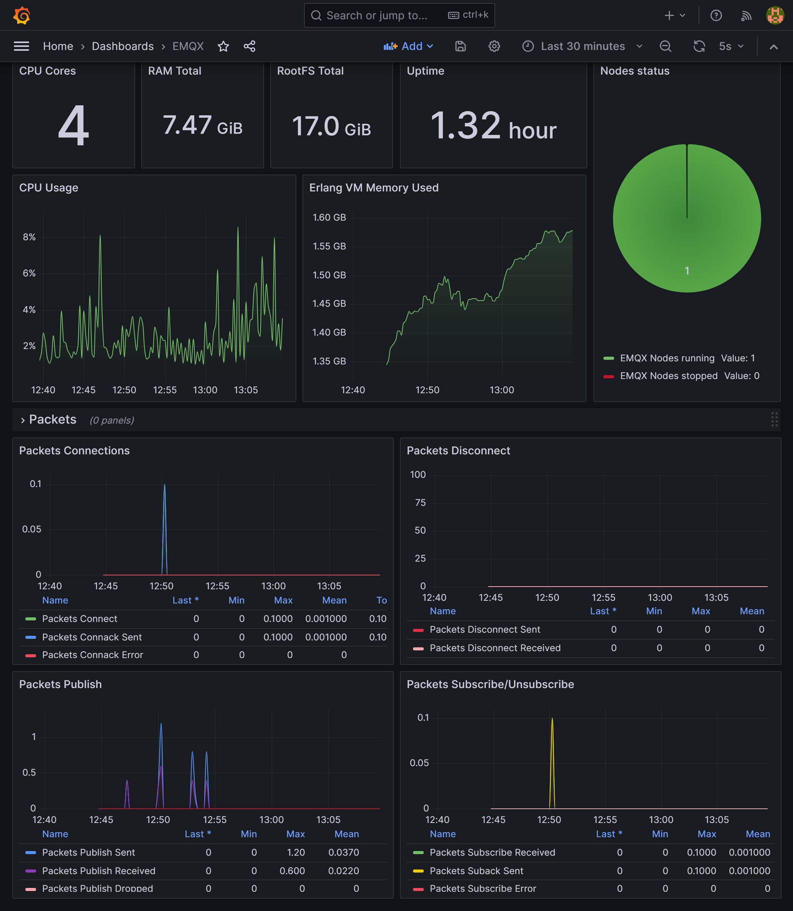

# MQTT Broker 性能監控最佳佈建方案 - EMQX(二)

<!--more-->

## 前言


在開始閱讀本文前 建議先瀏覽前篇文章 [高性能物聯網MQTT Broker - EMQX](https://as183789043.github.io/theme-document-docker-emqx/) 了解EMQX相關資訊


成功建立EMQX來作為MQTT的大腦之後 ，對於Server是否能承受相應的資源消耗是一個難以估量的場景，而透過監控性能上的變化，再由一個能及時反饋當前狀況的圖表。 相信能夠讓我們更進一步的去應對接下來會預期到的風險。  

但僅僅是如此還不能達到像標題描述的那麼厲害，我們需要一個有別於過去一個個組件安裝完成再進行資料串接的安裝方式。 ~~~讓自己可以更早下班😂~~~ 

而這就會提到今天的主角 **Docker compose !!** ，比Docker再更進階一些，但是可以一次部署多個Docker來達到一鍵啟動所有組件

## 開始之前
在正式進入我們今日主題之前，會需要準備的工具如下  

* Virtual Machine (Centos,Ubuntu)
* Docker 
* Docker Compose 
* git


1. Docker安裝可以參照[官方連結](https://docs.docker.com/engine/install/)選擇合適的作業系統
2. git 安裝
   1. ~~~bash
      sudo apt install git   #Ubuntu
      ~~~
   2. ~~~bash
      sudo yum install git   #Centos
      ~~~
 

## 前置步驟

1. 透過Git抓取本次檔案 並進入該資料夾
    ~~~bash
    git clone https://github.com/as183789043/EMQX-Single_Node_Monitor.git
    cd EMQX-Single_Node_Monitor
    ~~~
   
2. 新增檔案並修改權限 (理論上Docker compsoe 可以自己建立，但筆者實作時會有權限問題，故改為手動建立)
    ~~~bash
    mkdir emqx1_data
    chmod 777 emqx1_data
    ~~~

3. 啟動檔案
    ~~~bash
    docker compose up -d
    ~~~
  
到這裡就成功將所有監控組件啟動了，我們進入下一階段

## 檔案內容說明

對於拉取下來的檔案具體做了哪些事情，以及程式碼的細部講解都會在這個章節進行說明
1. docker-compose.yaml
    ~~~yaml
    version: '3'

    services:
      emqx1:
        image: emqx:5.3.2
        container_name: emqx1
        healthcheck:
          test: ["CMD", "/opt/emqx/bin/emqx ctl", "status"]
          interval: 30s
          timeout: 60s
          retries: 5
        ports:
          - 1883:1883
          - 8083:8083
          - 8084:8084
          - 8883:8883
          - 18083:18083 
        volumes:
          - ./emqx1_data/:/opt/emqx/data
        networks:
          emqx-bridge:
            aliases:
            - node1.emqx.io

      prometheus:
        image: prom/prometheus
        container_name: prometheus
        volumes:
          - ./prometheus.yaml:/etc/prometheus/prometheus.yaml
        command: --config.file=/etc/prometheus/prometheus.yaml
        ports:
          - 9090:9090
        networks:
          - emqx-bridge

      pushgateway:
        image: prom/pushgateway
        container_name: pushgateway
        ports:
          - 9091:9091
        networks:
          - emqx-bridge
        
      node-exporter:
        image: prom/node-exporter
        container_name: node-exporter
        ports:
          - 9100:9100
        networks:
          - emqx-bridge

      grafana:
        image: grafana/grafana-oss
        container_name: grafana
        ports:
          - 3000:3000
        networks:
          - emqx-bridge

    networks:
      emqx-bridge:
        driver: bridge

    ~~~

    
     version  : '3' 是目前docker compose的固定版本 可根據官網發布進行調整  
     services : 底下是各個組件的服務名稱(emqx1、prometheus) 
     container_name : 在虛擬機上的容器識別名稱
     ports    : 前者是外部連線port 後者是內部port
     volumes  : 外部文件掛載到容器的位置 
     networks : 使用的網卡，同一張容器才會互通 
     command  : 指定容器的啟動命令
     networks > emqx-bridge > driver : 定義網卡名為emqx-bridge 使用橋接模式
    

2. prometheus.yaml  -> 透過EMQX網頁生成。Targets在同一張網卡可以直接寫<容器名稱:port>
   ~~~yaml
    global:
      scrape_interval:     15s # The default scrape interval is every 10 seconds.
      evaluation_interval: 15s # The default evaluation interval is every 10 seconds.
      # On this machine, every time series will be exported by default.
      external_labels:
        monitor: 'emqx-monitor'

    # Load rules once and periodically evaluate them according to the global 'evaluation_interval'.
    rule_files:
      # - "first.rules"
      # - "second.rules"
      - "/etc/prometheus/rules/*.rules"

    # Data pull configuration
    scrape_configs:
      - job_name: 'node-exporter'
        scrape_interval: 5s
        static_configs:
          # node-exporter IP address and port
          - targets: ['node-exporter:9100']
            labels:
              instance: dashboard-local

    # EMQX Pushgateway monitoring
      - job_name: 'pushgateway'
        scrape_interval: 5s
        honor_labels: true
        static_configs:
          # Pushgateway IP address and port
          - targets: ['pushgateway:9091']
   ~~~
3. dashboard.json ->作為 Garfana儀錶板之模板設定檔

## 資料串接設定
### 重要組件連線資訊 **第一次登入要修改密碼**
|Service|Port|Username|Password|
| :--- | :--- | :--- | :--- |
|Grafana|3000|admin|public|
|EMQX|18083|admin|admin|  

### EMQX推送資訊設定
注意!!Pushgateay要輸入 <容器名稱:port>才能正確傳輸資料 
如果要生成自己的prometheus可以點選**幫助**來產生

### Grafana 設定資料來源
上一步驟將EMQX資料推至Prometheus。那麼在Grafana就要相應的將Prometheus設置為來源

選擇Prometheus後輸入輸入連線位置

其他保持預設 點選Save&test有**綠色**提示代表來源連接成功

### 匯入模板
依照以下路徑點選至匯入儀表板介面
Home > Dashboards >New  > Import dashboard

確定名稱及所屬Grafana路徑後點選 **import**

##  最後結果
匯入模板成功，就會看到一個類似下圖的儀表板

## 結語
雖然是快速部署，但在前期準備docker-compose.yaml會需要一些基礎知識，才能夠將容器進行完整打包。這部分筆者也是一邊試錯，一邊打包。
但相對的，未來在其他環境需要重現這樣的架構。就可以輕鬆的還原。節省未來花費的時間

另外是本篇文章著重架設監控系統，但Grafana還可以針對特定數值異常時發出警告。相關設定就留給各位去探索囉~~ 下課!!

