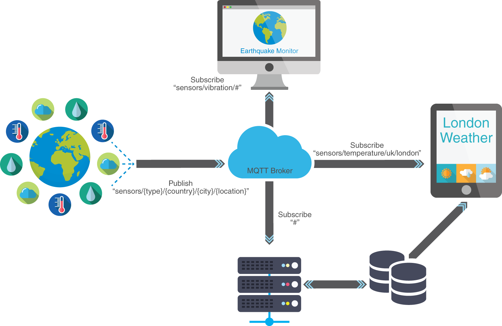
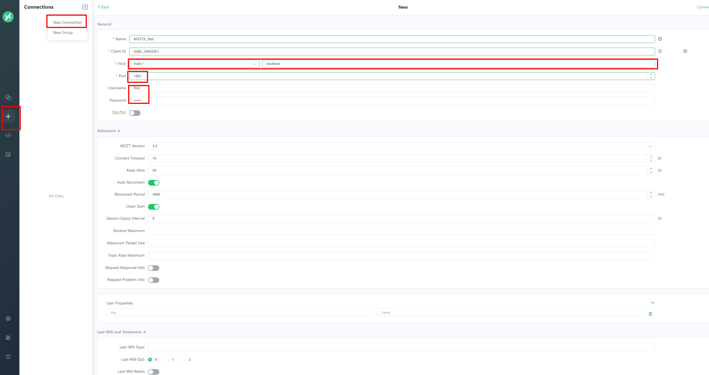

# 高性能物聯網MQTT Broker - EMQX


<!--more-->

## 前言

提到MQTT協定，大多數人第一個想到的場景應該是在物聯網的通訊之中，其中原因在於MQTT相比網頁上使用的HTTP協定來的更簡便，傳輸的封包訊息也更小。非常適用於在有限頻寬和計算資源的狀況下收發資料。<br>

至於MQTT具體協議是在做甚麼 就讓我們看下方的圖來說明



從圖中我們可以看到 正中間有一個類似MQTT大腦的地方，一般稱之為MQTT Broker， 這裡會將左邊的訊息發布(Publish) 轉送到右邊的訂閱者(Subscribe)手上。這樣就完成了一次消息的傳遞。 <br>

<b>問題: 那麼我們怎麼確認發布與通訊可以正確傳遞，但又不會拿到其他的雜訊? </b>

從圖中可以看到各個項目連接的地方有一些類似路徑的東西，這個是所謂的主題(Topic)，發布與訂閱在同一個主題才能接收到訊息。 <br>

如果想取得多個主題 可以在路徑中設置 <b>#</b> 來進行多主題讀取，但需要注意<b>/</b>代表分層且第一層開頭沒有<b>/</b>


## 與相似產品Mosquito的差異
老牌的Mosquito對於有研究IoT的愛好者來說，想必不陌生，其簡單的安裝方式。讓使用者可以快速體驗MQTT協議的各個組件如何設置。<br>

但相較之下有以下幾個理由令我覺得使用EMQX也不失為一個好選擇。

- 短時間可以處理更多的消息傳遞
- 直接有GUI畫面可以進行瀏覽和額外設置
- 內部可以將數據倒出Prometheus(時序性資料庫)進行存儲
- 如果需要使用在微務架構上，也有提供相應的安裝方式

[EMQX vs Mosquitto 官網詳細說明](https://www.emqx.com/zh/blog/emqx-vs-mosquitto-2023-mqtt-broker-comparison)


## 開始之前

在正式進入我們今日主題之前，會需要使用以下兩項工具來演示 
- Docker
- [MQTTX](https://mqttx.app/) 
  

如果缺少Docker環境可以看這篇[私有環境網站監控系統建置 - Uptime-kuma](http://localhost:1313/zh-tw/theme-document-docker-uptime_kuma/#%E7%82%BA%E4%BB%80%E9%BA%BC%E9%9C%80%E8%A6%81%E7%B6%B2%E7%AB%99%E7%9B%A3%E6%8E%A7%E5%B7%A5%E5%85%B7)中的安裝前置需求!!



## Docker啟動EMQX
安裝好Docker之後輸入以下指令 
```bash
docker run -d --name emqx \
  -p 1883:1883 -p 8083:8083 \
  -p 8084:8084 -p 8883:8883 \
  -p 18083:18083 \
  -v $PWD/data:/opt/emqx/data \
  -v $PWD/log:/opt/emqx/log \
  emqx/emqx:5.3.1
```


- -d : 背景運行  
- -p : 端口mapping(前者是電腦本的port 後者是容器內部的port)  
- -v : 目錄掛載進行永久化存儲($PWD = 電腦當前目錄)
- 1883 : MQTT標準通信Port
- 8083 : WebSocket 
- 8084 : 具有SSL 的 WebSocket
- 8883 : 具有SSL 的 MQTT
- 18083 : Web UI



本地環境如果沒有EMQX的image，Docker run 會自動到Docker Hub 上去下載，看到如右側的指令跑完，在瀏覽器上輸入 [http://lcoalhost:18083](http://localhost:18083)即可進入Login Page 

Username : admin  
Password : public

第一次登系統會提示修改密碼
  


## 功能探索

### 系統資訊概覽
進入首頁後預設簡體中文，可以透過右上角齒輪選擇語言 和黑/白模式
紅框中的內容可以看到系統的資訊概覽，例如:系統資源、MQTT訂閱數量、目前有多少Topic
 

<br>

### 建立一個User


建立用戶資料庫


可以看到用戶資料庫已經建立，點選User 進入裡面新增之後要用的Username


新的user沒有帳號複雜度限制  


至此已經建立了連線的必備資訊，我們可以開始透過連線來使用EMQX了

## MQTT連線測試
點選新連線輸入以下資訊
- HOST : MQTT + 連線IP(本機用localhost)
- Port : 1883
- Username : 上一小節設定的帳號
- Password : 上一小節設定的密碼 


設定好連線後需要先設定訂閱主題 後續才能收到發布  

訂閱主題 -> topic/#  
發佈主題 -> topic/123、topic/456  

圖片中的紅線代表著分別是哪一方產生的回應(訂閱、發佈)

圖片中發佈訊息框上面有一個寫者 topic/456 的欄位 更改這裡可以發佈不同主題 


## WebSocket 連線設定


接下來我們可以透過同一個頁面的下方發佈和訂閱消息，但如果消息訂閱主題錯誤，會產生有送出但沒收到的狀況


## 圖表檢視
回到首頁可以看見剛才進行連線的資訊已經整理成時序性圖表呈現  
- Incoming Messages 指的是發佈傳入MQTT Broker的數量
- Outgoing Messages 指的是傳入訂閱的數量


## 結語
相信上述的操作能讓讀者對EMQX有更進一步的認識，對於現在的環境來說，具有足夠好的擴展能力對於將MQTT協議帶入現實能力式不可少的。而這部分在此工具都有相應的滿足需求。且操作下來只要有了解MQTT組件間的傳遞就很容易上手。

當然這些只是入門，後續還會有更進階的操作可以發掘，比如使用中間件進行數據轉換，與資料庫整合、設置黑名單等等功能 就留給各位去探索了


