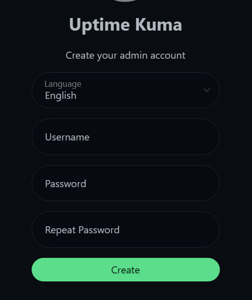
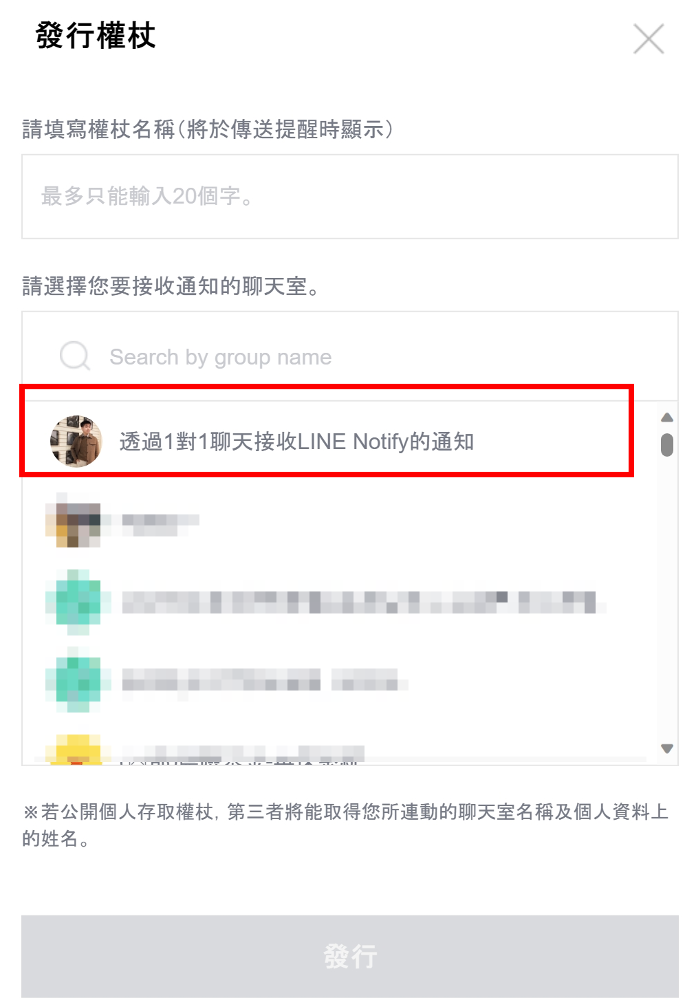
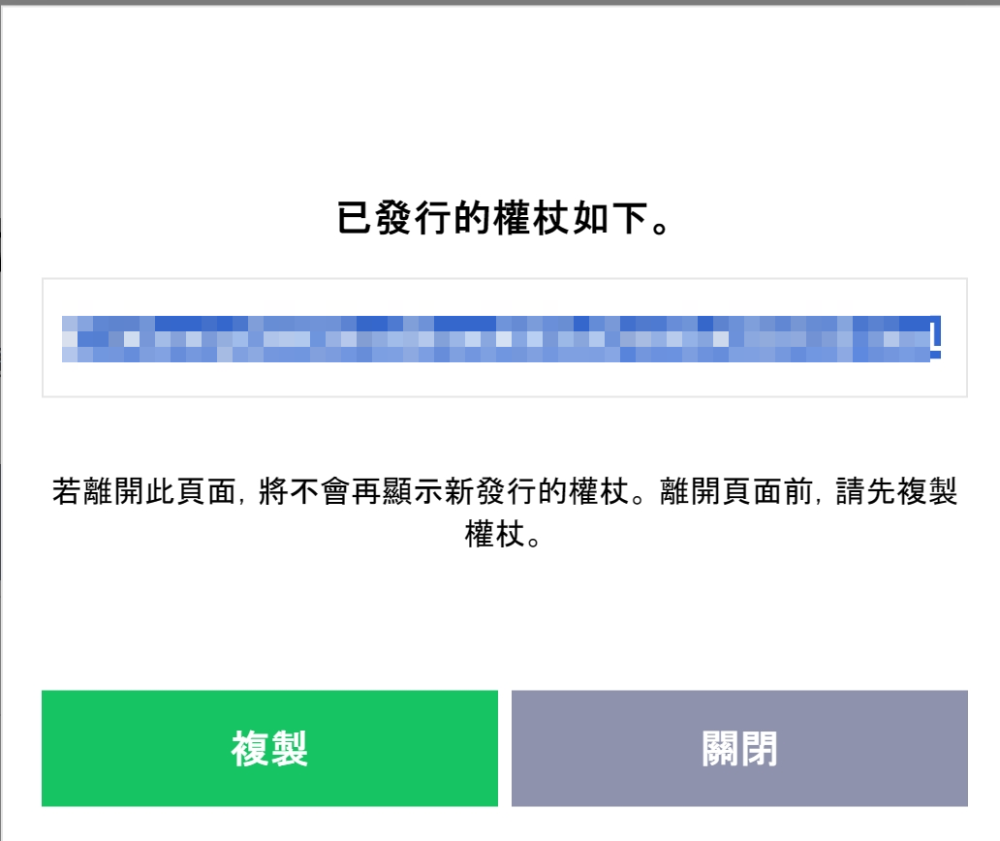
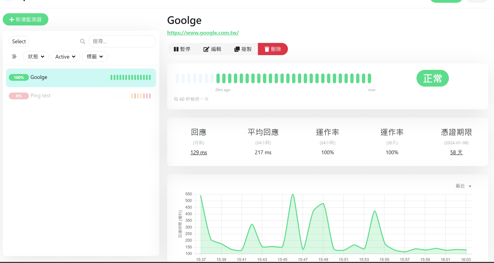

# 私有環境網站監控系統建置 - Uptime-kuma

<!--more-->

## 為什麼需要網站監控工具    

在一般有部署網站的環境中，最重要的就是知道現在網站提供的服務有沒有掛掉或是憑證有沒有到期    

 
而這些事情在過去都是透過編寫腳本或程式來進行監控，對於沒有技術背景的使用者來說，異常麻煩。尤其是監控寫好了 還要能在出狀況時進行通知 無疑是讓合理的監控變得更麻煩   

  

秉持著 複雜的事情先上網找現成工具沒有再靠自己的想法。 所以就有了今天的主角 Uptime-kuma  

 


如果想在安裝前先體驗線上版介面和進行基礎的設定可以參考下方連結

[Demo 網站連結 10 分鐘可用版](https://demo.uptime.kuma.pet)  


  
那麼 我們就開始安裝在自己環境中來體驗無期限使用的效果吧  

 
- 需要一台有Docker 的環境  (安裝方法如下)
  - Windows
    1. 以管理員身份運行 PowerShell 或 Windows 命令提示符 安裝WSL 然後重啟電腦
    ~~~ Powershell
    wsl --install
    ~~~
    2. 下載Docker Desktop
  
  - Ubuntu 複製貼上在Terminal 即可
    ~~~bash
    sudo apt-get update
    sudo apt-get install \
    ca-certificates \
    curl \
    gnupg \
    lsb-release
    sudo mkdir -m 0755 -p /etc/apt/keyrings
    curl -fsSL https://download.docker.com/linux/ubuntu/gpg | sudo gpg --dearmor -o /etc/apt/keyrings/docker.gpg
    echo \
    "deb [arch=$(dpkg --print-architecture) signed-by=/etc/apt/keyrings/docker.gpg] https://download.docker.com/linux/ubuntu \
    $(lsb_release -cs) stable" | sudo tee /etc/apt/sources.list.d/docker.list > /dev/null
    sudo apt-get update
    sudo apt-get install docker-ce docker-ce-cli containerd.io docker-buildx-plugin docker-compose-plugin -y
    sudo gpasswd -a $USER docker 
    newgrp docker
    ~~~


## Uptime-kuma安裝

進入Power Shell / Terminal 輸入以下指令
~~~docker
docker run -d --restart=always -p 3001:3001 -v uptime-kuma:/app/data --name uptime-kuma louislam/uptime-kuma:1
~~~

 
  >- -d 會讓容器在背景運行 
  >- -restart 開機啟動docker自動啟動監控
  >- -p 內部的網路端口對應到外部(主機)的端口號
  >- -v 資料儲存位置 本機的當前目錄新增uptime-kuma資料夾 同步容器的app/data 目錄
 

### 連線UI介面

如果想在安裝前先體驗線上版介面和進行基礎的設定可以參考下方連結
~~~
http://localhost:3001
~~~
如果Ubuntu沒有裝桌面的話 可以參考以下方法
~~~bash
  ufw allow 3001 #打開對外防火牆
  ip  -a  #找出當前主機的ip 再用外部連線進入
~~~


## UI設定
進入UI需要設定帳號密碼   
  

從最簡單的網頁監測開始    
  
輸入要監控的網址

  
如果有進階需求 如查看憑證剩餘天數也可以勾選    
  

## 告警系統 Line Notify 設定
可以設定不只一個通知  
  
看到需要token 且下方有教學如何從哪裡取的 點選下方紅框中的網址
  
點選右上角  
  
可選擇用帳號還是qrcode登入  
  
可選擇notify如何發送通知可以是指針對本人或是在群組中發出  測試先用1對1看效果  
  

登入後滑到最下方 點選發行權杖  
  
取得token回填網頁即可  
  

## 模擬監控失敗範例
Ping 的設定檔如下 ping的類型和 模擬一個不存在的網址 再配上通知設定  

## 結果
可以看到網站的回應時間平均在0.2秒，回應率正常且憑證在58天後到期  

如果失敗會發出訊息  

## 參考資料
[官方Github](https://github.com/louislam/uptime-kuma)
