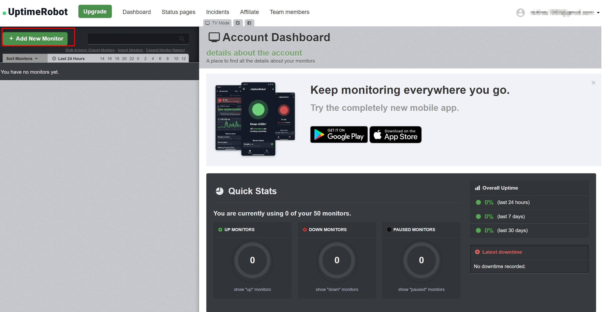

# 免費線上網頁監控服務 - UptimeRobot

<!--more-->

## 前言
此篇文章為接續上篇 
[私有環境網站監控系統建置 - Uptime-kuma](http://localhost:1313/zh-tw/theme-document-docker-uptime_kuma/) 之後續內容 

兩者區別在於如果需要監控的服務已經可以透過瀏覽器連上 且不打算自己在本地架設監控系統的狀況下 就有UptimeRobot的用武之地了!!  

 

## 免費版限制
下圖是從官方網站上的封面取得，在免費的使用條件下可以設置50個監控目標，每5分鐘進行一次檢查
  

## 註冊步驟

[官網註冊連結](https://uptimerobot.com/signUp?ref=website-header) 
 
輸入註冊資訊  
 

到信箱啟用帳戶 
 

  
## 新增監控目標  


後續設定中看到有 *PAID* 都是需要升級才能享有的權益
 

信箱跳轉到首頁UptimeRobot首頁 可以看到有手機版可以下載(~~~不用隨時隨地都帶著電腦了XD~~~) 接著點選+Add New Monitor 
 

選擇監控類型

進行設定以部落格存活狀況為例 (詳細設定說明可展開info區塊)   

   


URL(IP) 暴露在公網可以連線的IP   
Monitoring Interval : 檢查的間隔 可以大於5分鐘 但不能小於(要升級)  
Monitor Timeout : 檢查當下多久沒回應判定異常  
 

## 測試與結果
設定完成可以透過測試來檢查設定是否正確 
  

回到信箱查看 服務正常，但時區異常

 
更改時區設定 (測試後信件時區正常，儀錶板仍為UTC+0)

## 結論

與自建服務版本相比缺少一些常用功能 比如以下
- 沒有SSL憑證到期檢測
- 通知系統預設Email 其他需要額外設定且台灣常用的Line無法支援
  
但既然是免費的 有一些功能缺少也在合理範圍內。使用上就需要依場景區選擇是否使用這項工具!  
 
另外附上升級前後的權益差別供各位讀者參考 
[UptimeRobot-Pricing](https://app.uptimerobot.com/billing/pricing/)

## 同場加映 手機APP畫面瀏覽
下載手機APP後可以透過手機 來及時間了解網站狀況 且會多出一個手機通知選項(需要在Alert中打開)

給各位看一下手機版的版面來當作本文的結尾

